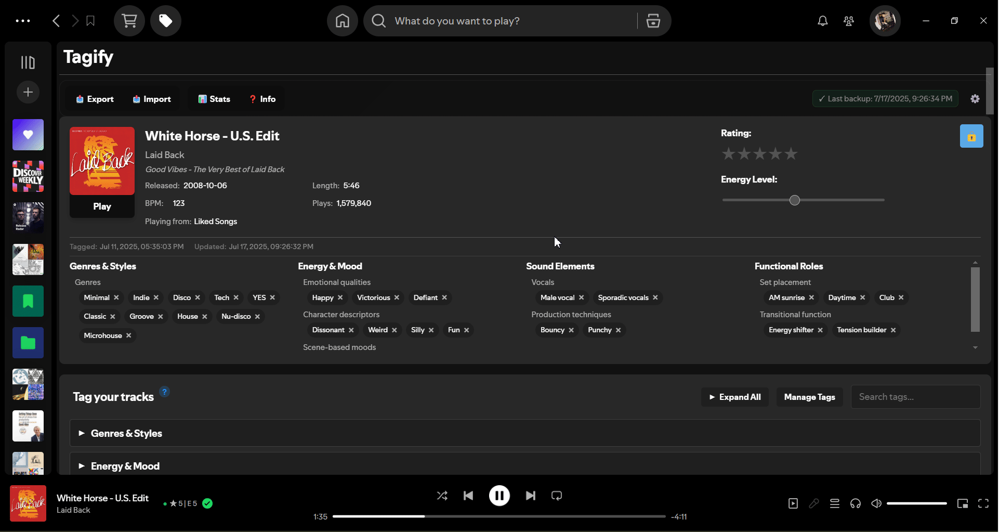
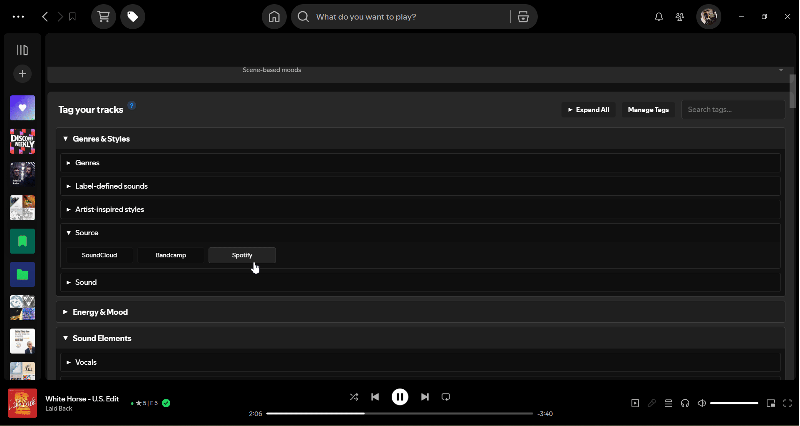
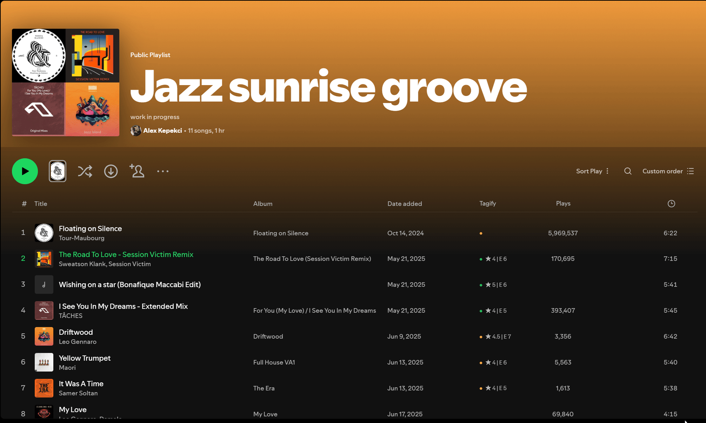

# Tagify

Tagify is a powerful [Spicetify](https://github.com/spicetify/cli) custom app that brings advanced music tagging and organization capabilities to Spotify.

[](https://github.com/alexk218/tagify/releases)
[](LICENSE)
[](https://github.com/alexk218/tagify/stargazers)

## Demo

Check out a video walkthrough of Tagify in action: [YouTube demo](https://www.youtube.com/watch?v=0N1yp8--mTQ)

## Motivation

After years of failed attempts to organize my 10,000+ track collection, I built what every lover of music needs: a way to tag, rate, and find music the way your brain thinks about it.

---

### **Track Tagging**

Rate tracks, set energy levels, and apply custom tags. Turn vague music memories into organized, searchable data.



### **Creating & Managing Tags**

Build your own tag system that matches how _you_ think about music.



### **Smart Filtering & Playlist Creation**

Create playlists by filtering by any combination of tags, ratings, energy, and BPM.


### **Bulk Tagging Multiple Tracks**

Select multiple tracks and apply tags in bulk.



---

## Quick Start

### Prerequisites

You'll need **Spicetify** installed on your computer.

➡️ **[Complete Spicetify Installation Guide](SPICETIFY_INSTALLATION.md)**

## Install Tagify

### **One-Click Install (recommended)**

### Windows

Open **Powershell** and run this command:

```powershell
iwr -useb "https://raw.githubusercontent.com/alexk218/tagify/main/install.ps1" | iex
```

### macOS/Linux

Open **Terminal** and run:

```bash
curl -fsSL "https://raw.githubusercontent.com/alexk218/tagify/main/install.sh" | bash
```

### **Manual install**

#### **1. Download Tagify**

- Go to the [Releases page](https://github.com/alexk218/tagify/releases)
- Download latest .zip file

#### **2. Find your Spicetify folder**

- **Option 1:** Use the Spicetify CLI

  1. Run `spicetify config-dir` to open the Spicetify folder
  2. Open the `CustomApps` folder.

- **Option 2:** Manually navigate to the folder
  - **Windows**: `Windows + R` - `%APPDATA%\spicetify\CustomApps`
  - **Mac**: `Cmd + Shift + G` - `~/.config/spicetify/CustomApps`

#### **3. Extract Tagify**

- Extact/unzip the downloaded .zip file.
- Drag `tagify` folder into `CustomApps` folder

#### **4. Activate Tagify**

- Open PowerShell (Windows) or Terminal (Mac/Linux):

  ```bash
  spicetify config custom_apps tagify
  spicetify apply
  ```

**5. Start using Tagify!**

- Restart Spotify completely
- Look for "Tagify" in your Spotify **top navigation bar** (next to the Spicetify Marketplace button)
- Click it to open Tagify!

## Community & Support

- **Feature Requests**: [Share your ideas](https://github.com/alexk218/tagify/discussions/categories/ideas-feature-requests)
- **Get Help**: [Ask questions](https://github.com/alexk218/tagify/discussions/categories/q-a)
- **Report Bugs**: [Bug reports](https://github.com/alexk218/tagify/discussions/categories/bug-report)
- **Announcements**: [Latest updates](https://github.com/alexk218/tagify/discussions/categories/announcements)
